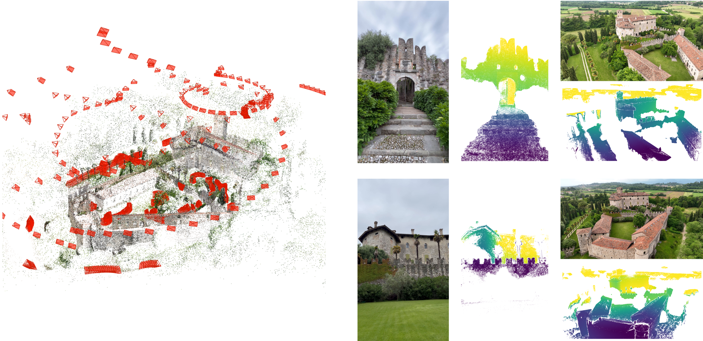
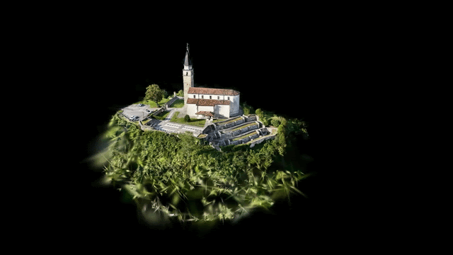

<div align="center">
  <h1>TerraSky3D: Multi-View Reconstructions of European Landmarks in 4K</h1>

  <p>
    <a href="https://mattiadurso.github.io/">Mattia D'Urso</a><sup>1</sup> · 
    <a href="https://scholar.google.com/citations?user=U6yM89YAAAAJ&hl=zh-CN">Yuxi Hu</a><sup>1</sup> · 
    <a href="https://scholar.google.com/citations?user=6uZVF04AAAAJ&hl=en">Christian Sormann</a><sup>2</sup> · 
    <a href="https://scholar.google.com/citations?user=DA3nSvgAAAAJ&hl=en">Mattia Rossi</a><sup>2</sup> · 
    <a href="https://scholar.google.com/citations?user=M0boL5kAAAAJ&hl=en">Friedrich Fraundorfer</a><sup>1</sup>
  </p>

  <p>
    <sup>1</sup>Graz University of Technology · <sup>2</sup>Sony
  </p>

  <h3>
    <a href="https://3dmv.org/2026/">3DMV</a> at CVPR Workshop 2026
  </h3>

<p align="center">
  <a href="https://github.com/mattiadurso/TerraSky3D">
    
  </a>
  &nbsp;
  <a href="https://huggingface.co/datasets/mattia-durso/TerraSky3D">
    
  </a>
  &nbsp;
  <a href="https://arxiv.org/abs/2603.28287">
    
  </a>
</p>

  
  <br>
  <p><em>Left: Sparse 3D reconstruction of the Villalta Castle, Italy. Right: Representative images collected from aerial and ground perspectives, shown with their corresponding geometrically and semantically filtered depth maps.</em></p>

  <div style="display: flex; justify-content: center; gap: 5px;">
    
    
    
  </div>
  <p><em>Examples of 3DGS reconstructions of aerial and ground scenes from TerraSky3D.</em></p>
</div>


## Abstract

Despite the growing need for data of more and more sophisticated 3D reconstruction pipelines, we can still observe a scarcity of suitable public datasets. Existing 3D datasets are either low resolution, limited to a small amount of scenes, based on images of varying quality because retrieved from the internet, or limited to specific capturing scenarios.

Motivated by this lack of suitable 3D datasets, we captured TerraSky3D, a high-resolution large-scale 3D reconstruction dataset comprising ~50,000 images divided into 150 ground, aerial, and mixed scenes. The dataset focuses on European landmarks and comes with curated calibration data, camera poses, and depth maps. TerraSky3D tries to answer the need for challenging dataset that can be used to train and evaluate 3D reconstruction-related pipelines. 

## 📊 Training/Test Set Statistics (v1.0)

<!-- from nb_test_TS3D.ipynb -->

| Metric | Train | / | Test | Description |
| :--- | ---: | :---: | :--- | :--- |
| **Scenes** | 138 | / | 12 | Number of scenes. |
| **Images** | 44,505 | / | 3,018 | Number of high-resolution (4K) images provided in the dataset. |
| **Pairs** | 2,671,062 | / | 43,720 | Total stereo/overlapping image pairs captured. |
| &nbsp;&nbsp;↳ **Ground** | 1,729,147 | / | 32,718 | Pairs captured only from a ground perspective. |
| &nbsp;&nbsp;↳ **Aerial** | 728,502 | / | 6,308 | Pairs captured only from an aerial perspective. |
| &nbsp;&nbsp;↳ **Mixed** | 213,413 | / | 4,694 | Pairs captured from both aerial and ground views. |

## 📁 Download & Format

The dataset can be downloaded from <a href="https://huggingface.co/datasets/mattia-durso/TerraSky3D"> Hugging Face 🤗 </a>.

Use `data_viewer.ipynb` to generate `train_data.json` and visualize examples of pairs of images from all the dataset or just mixed aerial and ground pairs.

-------

The dataset follows a structured format for seamless integration into SfM and novel view synthesis pipelines:

```text
data/scene/
  ├── colmap/                  # Structure-from-Motion outputs in COLMAP format
  │   └── sparse/
  │       └── 0/               
  │           ├── cameras      # Intrinsic parameters
  │           ├── images       # Extrinsic parameters / poses
  │           └── points3D     # Sparse point cloud
  ├── frames/                  # Extracted video frames
  │   ├── cam_0/
  │   │   └── frame_000000.jpg # Format: cam_i/frame_*.jpg
  │   ├── cam_1/
  │   │   └── frame_000000.jpg
  │   └── ...
  ├── depth/                   # Multi-View Stereo depth outputs
  │   ├── maps/                # Raw depth estimations from APD-MVS
  │   │   ├── cam_0/
  │   │   │   └── frame_000000.h5
  │   │   └── ...
  │   ├── masks_geometric/     # Geometric masks from APD-MVS
  │   │   ├── cam_0/
  │   │   │   └── frame_000000.png
  │   │   └── ...
  │   └── masks_semantic/      # Semantic masks from Mask2Former
  │       ├── cam_0/
  │       │   └── frame_000000.png
  │       └── ...
  └── train_data.json          # Dictionary containing scenes, images, and camera parameters
```


## 🙏 Acknowledgments

We thank Davide Casano, Luca Danelutti, Federico Fattori, Alessandro Menafra, Florian Thaler, Runze Yuan, and Stefano Zorzi for their invaluable contributions to the data collection process.


## 📝 Citation
If you find this dataset or code useful in your research, please consider citing:

```bibtex
@article{durso202Xterrasky3d,
  title={TerraSky3D: Multi-View Reconstructions of European Landmarks in 4K},
  author={D'Urso, Mattia and Hu, Yuxi and Rossi, Mattia and Sormann, Christian and Fraundorfer, Friedrich},
  booktitle={IEEE Conference on Computer Vision and Pattern Recognition},
  year={2026}
}
```
